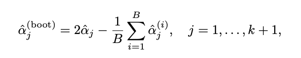

# pwpldis Package

<!-- badges: start -->
[](https://github.com/njerezlillo/pwpldis/actions/workflows/R-CMD-check.yaml)
[](./LICENSE)

<!-- badges: end -->

This package provides tools for fitting the discrete piecewise power-law model, a flexible statistical framework for modeling data that exhibits power-law behavior in different segments. It is applicable to fields such as complex networks and heavy-tailed phenomena. The package includes:

- Base Functions: Implementation of various functions related to the model, such as density, survival, hazard, random number generation, and more.
- Maximum Likelihood Estimation: A method for estimating model parameters, including change points and scaling parameters.
- Bootstrap Bias Correction: A resampling procedure for correcting estimation bias and quantifying uncertainty.

## Progress status

- [x] Set up the package structure  
- [x] Write functions  
- [x] Document functions
- [x] Write examples for each function in the package
- [x] Check the documentation
- [x] Publish on GitHub  
- [x] Complete the "Example" section on GitHub
- [ ] Distribute on CRAN

## Installation

You can install the package using:

``` r
# install.packages("devtools")
devtools::install_github("njerezlillo/pwpldis")
```

## Example

This section provides a concise example demonstrating how to use the main functions of the package:

We begin by generating a dataset of 1,000 observations using the `rpwpldis` function from the discrete piecewise power-law model with specified parameters and change points. In this example, `p` represents the change points that define distinct power-law segments within the distribution, while `alpha` refers to the corresponding scaling parameters of each segment:

``` r
library(pwpldis)

p <- c(1, 10)
alpha <- c(1.5, 3.5)
df <- rpwpldis(1000, p, alpha)
```

We estimate the discrete piecewise power-law model for the previously generated dataset `df` using the `fit_pwpldis` function. The argument `nbreak = 1` indicates that the model should be fitted with a single change point. This function returns the estimated location of the change point along with the corresponding scaling parameters:

``` r
fit_1 <- fit_pwpldis(df, nbreak = 1)
```

In this step, we apply a bootstrap procedure using the estimated change point from `fit_1$tau_1` with two main objectives: 

- Creating bias-corrected versions of the maximum likelihood estimators.
- Constructing bootstrap confidence intervals for the model parameters.

``` r
boot_1 <- boot_pwpldis(df, brks = fit_1$tau_1)
```

First, we compute the bias-corrected estimators using the following equation (see Jerez-Lillo N. *et al.*, 2025):

<p align="center">
  
</p>

```r
2 * fit_1[, 3:4] - apply(boot_1[, 3:4], 2, mean)
```

Second, we compute the 95% confidence intervals for the scaling parameters of the piecewise model using the empirical quantiles of the bootstrap replicates:

``` r
apply(boot_1[, 3:4], 2, function(x) quantile(x, c(0.025, 0.975)))
```

Finally, we plot the empirical cumulative distribution function of the simulated dataset to visually assess how well the data follows the cumulative distribution function of the fitted model:

``` r 
plot(ecdf(df), cex = 0.5, main = "Empirical vs. Fitted CDF", xlab = "x", ylab = "CDF")
cdf <- Vectorize(function(x) ppwpldis(x, c(1, 10), c(1.48, 3.49)))
points(unique(df), cdf(unique(df)), col = "red", cex = 0.5)
legend("bottomright", legend = c("Empirical", "Fitted"), col = c("black", "red"), pch = c(1, 1))
```

## Citation

To cite `pwpldis` package in publications, please use the following format:

Jerez-Lillo N (2025). *pwpldis: Discrete Piecewise Power-Law Model*. R package version 1.0.0, [https://github.com/njerezlillo/pwpldis](https://github.com/njerezlillo/pwpldis).

For LaTeX users, the corresponding BibTeX entry is:

```bibtex
@Manual{
  title = {pwpldis: Discrete Piecewise Power-Law Model},
  author = {Nixon Jerez-Lillo},
  year = {2025},
  note = {R package version 1.0.0},
  url = {https://github.com/njerezlillo/pwpldis},
}
```

## References  

[**Beyond the Power Law: Estimation, Goodness-of-Fit, and a Semiparametric Extension in Complex Networks**](https://arxiv.org/abs/2311.11200)  
*Jerez-Lillo N., Rodrigues F. A., Ferreira P. H., Ramos P. L.*  
arXiv preprint arXiv:2311.11200 
